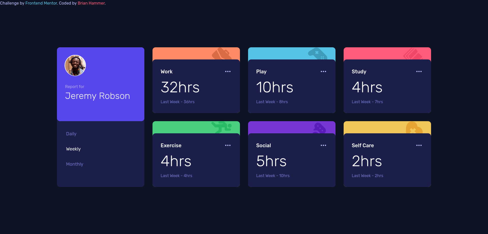
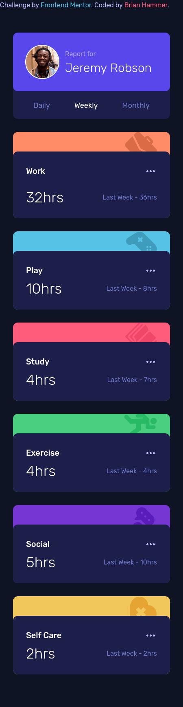

# Frontend Mentor - Time tracking dashboard solution

This is a solution to the [Time tracking dashboard challenge on Frontend Mentor](https://www.frontendmentor.io/challenges/time-tracking-dashboard-UIQ7167Jw). Frontend Mentor challenges help you improve your coding skills by building realistic projects. 

## SETUP

Run this command when editing: 
npx tailwindcss -i ./input.css -o ./output.css --watch

## Table of contents

- [Overview](#overview)
  - [The challenge](#the-challenge)
  - [Screenshot](#screenshot)
  - [Links](#links)
- [My process](#my-process)
  - [Built with](#built-with)
  - [What I learned](#what-i-learned)
  - [Continued development](#continued-development)
  - [Useful resources](#useful-resources)
- [Author](#author)
- [Acknowledgments](#acknowledgments)

**Note: Delete this note and update the table of contents based on what sections you keep.**

## Overview

### The challenge

Users should be able to:

- View the optimal layout for the site depending on their device's screen size
- See hover states for all interactive elements on the page
- Switch between viewing Daily, Weekly, and Monthly stats

### Screenshot

## Desktop View

## Mobile View

### Links

- Solution URL: [https://github.com/BrianHammer/fm-time-tracking-dashboard](https://github.com/BrianHammer/fm-time-tracking-dashboard)

- Live Site URL: [Add live site URL here](https://your-live-site-url.com)

## My process

Bash my head against the keyboard.

### Built with

- Semantic HTML5 markup
- CSS custom properties
- Flexbox
- CSS Grid
- Mobile-first workflow

### What I learned

I learned how to add the top visual part of each cell. This was also a good exercise to improve my flexbox and grid skills. 

### Continued development

I would make the spacing more accurate if I were to continue working. I would also experiment with an "ipad" view because the site looks strange on medium screens before the breakpoint.

### Useful resources

Tailwind Docs.

## Author

- Frontend Mentor - [@brianhammer](https://www.frontendmentor.io/profile/brianhammer)